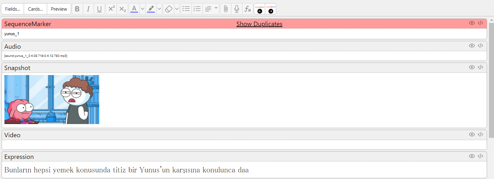
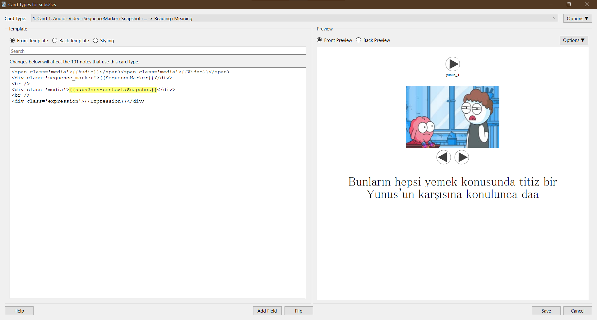

Anki add-on that adds editor buttons to play the recordings of next and previous notes
in [subs2srs](http://subs2srs.sourceforge.net/) notes.



Besides the editor buttons, the add-on provides a template filter named `subs2srs-context` to show play buttons when reviewing:

```
{{subs2srs-context:Snapshot}}
```



## Download

You can get the add-on from its page on AnkiWeb: https://ankiweb.net/shared/info/1369461620

## TODO

- [ ] provide options to show more context information besides recordings.
